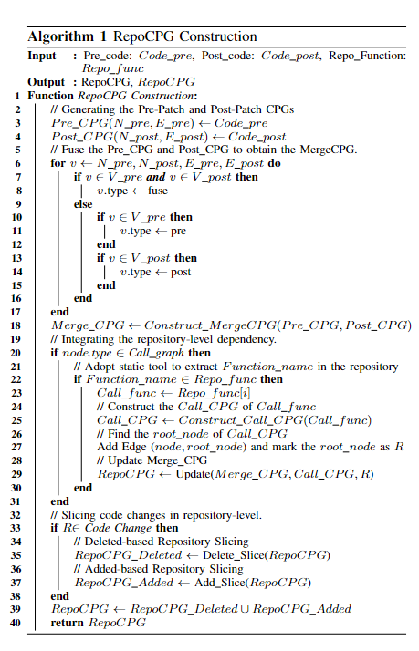

<div align="center">
    <p>
    <h1>
    RepoSPD
    </h1>
    
    </p>
    <p>
    (Logo generated by DALL·E 3)
    </p>
    <a href="https://github.com/ddlBoJack/MT4SSL"></a>
    <a href="https://github.com/ddlBoJack/MT4SSL"></a>
    <a href="https://github.com/ddlBoJack/MT4SSL"></a>
</div>


### 📥 Environment
Our code is based on Python3 (>= 3.8). There are a few dependencies to run the code. The major libraries are listed as follows:
```bash
pip install numpy==1.24.4
pip install torch==1.11.0+cu113 torchvision==0.11.0+cu113 torchaudio==0.11.0+cu113
pip install tree-sitter==0.21.1
pip install transformers==4.41.2

# install clang
pip3 install clang==6.0.0.2
sudo apt install clang -y
sudo ln -s /usr/lib/x86_64-linux-gnu/libclang-*.so.1 /usr/lib/x86_64-linux-gnu/libclang.so
# install torch-geometric
pip install torch-scatter==2.0.9 torch-sparse==0.6.13 torch-cluster==1.6.0 torch-spline-conv==1.2.1 torch-geometric -f https://data.pyg.org/whl/torch-1.11.0+cu113.html
# install java 8
sudo apt-get install openjdk-8-jre

```


### 📅 Dateset
We use [**PatchDB**](https://huggingface.co/datasets/sunlab/patch_db) and [**SPI-DB**](https://sites.google.com/view/du-commits/home) as our dataset, respectively.  

```bash
https://huggingface.co/datasets/sunlab/patch_db
```

```bash
(https://sites.google.com/view/du-commits/home)
```

We will release the repository-level datasets：SPIDB* and PatchDB* later.


### 🛠️RepoSPD
#### 🔍 1. Generating MergeCPG

Before you start, please make sure that you've set a correct **absolute** path to the `release` directory in `data_loader.py`

```python
# ./data_preproc/data_loader.py
root = '/path_to_release' # Absolute path to `release`
```

```bash
chmod +x -R ./joern;
cd data_preproc;
python3 data_loader.py;
```

#### ⚖️ 2. RepoCPG Construction
Before you start, please make sure that you've set a correct **absolute** path to the `release` directory in `get_dependency.py` and `add_dep.py`

###### (1) Get repository-level dependency
```bash
cd add_dependency;
python3 get_depend.py;
```

###### (2) MergeCPG to RepoCPG
After getting repository-level dependencies, run`add_dep.py` to add these dependencies to the MergeCPG.
```bash
cd add_dependency;
python3 add_dep.py;
```

#### 🔔 3. Training RepoSPD
Divide your data into 3 subsets: *train*, *valid* and *test* before training. Then set the root path to the 3 subsets in `run.py` by modifying the variables `root` and `dataPath`. Besides, some cached data will be saved to `root` while running.

For example:
```python
# ./run.py
root = './dataset/'
dataPath = root + 'example_dataset' # the 3 subsets are in example_dataset
```

Finally, run!
```bash
python3 run.py
```


### Response-Phase

#### Reviewer(A) Q1: Algorithim 1



Algorithim 1. RepoCPG Construction.

#### Reviewer(A) Q7: Repository-level  Dataset / Results available
The Dataset and Results for RepoSPD is now available.  

You can find the entire datasets at:
```bash
https://drive.google.com/file/d/1esVwN0BB-DcKPzVd7gG_ZAhABvrbWjo3/view?usp=drive_link
```

The experimental results of RepoSPD is in the directory `Results`. 
For RQ2, we also provide the 192 patches we used in our experiment at `Results/RQ2/test_data.jsonl`.


#### Reviewer(B) Q1: What is the impact of additional context on false negatives
| Dataset  | Baseline | Accuracy | Precision | Recall | F1 Score | FPR   |
|----------|----------|----------|-----------|--------|----------|-------|
| PatchDB* | CodeT5    | 80.84    | 73.62     | 58.52  | 65.21    | 9.28  |
|          |**RepoSPD**|**83.35**| **80.18** | **60.76**  | **69.13**    | **6.65**  |
| SPI-DB*  | CodeT5    | 66.62    | 61.17     | 62.59  | 61.87    | 30.31 |
|          |**RepoSPD**|**74.55**| **78.07** | **61.79**  | **68.98**    | **14.67** |

Table. 1 Experimental results of false negatives.

#### Reviewer(B) Q4: Why the authors chose to train the model using sequence representation and then refine it for graph representation？

 
| Dataset  | Baseline | Accuracy | F1 Score | FPR   |
|----------|----------|----------|----------|-------|
| SPI-DB*  | Varient  | 67.45    | 62.65    | 25.92 |
|          | RepoSPD  | **74.55**    | **68.98**    | **14.67** |
| PatchDB* | Varient  | 81.66    | 68.25    | 10.62 |
|          | RepoSPD  | **83.35**    | **69.13**    | **6.65**  |

Table. 2 Experimental results of varient (i.e., first trains the graph representation and then refines it into a sequence representation) and RepoSPD.

#### Reviewer(C) Q1: Hyper-parameters.
| Hyperparameter | Value  | Accuracy  | F1 Score  |   FPR    |
|:--------------:|:------:|:---------:|:---------:|:--------:|
| Head           |   1    |   83.11   |   67.72   |   5.66   |
|                | **2**  | **83.35** | **69.13** | **6.65** |
|                |   4    |   82.25   |   68.65   |   9.38   |
|                |   8    |   82.90   |   69.19   |   8.09   |
| Learning Rate  |  1e-4  |   82.94   |   68.29   |   6.85   |
|of Graph Branch |**5e-5**| **83.35** | **69.13** | **6.65** |
|                |  2e-5  |   82.90   |   68.72   |   7.49   |
|                |  1e-5  |   82.83   |   68.71   |   7.69   |
| Batch Size     |   1    |   80.74   |   67.10   |   11.86  |
|                |   2    |   81.53   |   68.69   |   11.61  |
|                | **4**  | **83.35** | **69.13** | **6.65** |
|                |   8    |   81.46   |   67.31   |   10.02  |

Table. 3 Experimental results of different hyperparameters.

#### Reviewer(C) Q2: Training and inference time.

| Baseline | Time \ Dataset    | PatchDB* | SPI-DB* |
|----------|-------------------|----------|---------|
| CodeT5   | Train time (s)    | 1573.56  | 1171.95 |
|          | Inference time (s)| 99.015   | 90.27   |
| RepoSPD  | Train time (s)    | 420.45   | 436.70  |
|          | Inference time (s)| 37.20    | 27.38   |

Table. 4 Time cost between RepoSPD and CodeT5 per epoch training and inference time. 


#### Reviewer(C) Q3: AUC and T-Test

| Dataset  |   Model    | Accuracy|   AUC   |  P-value |
|----------|------------|---------|---------|----------|
| PatchDB* |   CodeT5   |  80.84  |  74.62  | 1.5e-02  |
|          | **RepoSPD**|**83.35**|**77.06**|  -       |
| SPI-DB*  |   CodeT5   |  66.62  |  66.13  | 5.46e-07 |
|          | **RepoSPD**|**74.55**|**73.56**|  -       |

Table. 5 Experimental results of AUC and statistical analysis.


